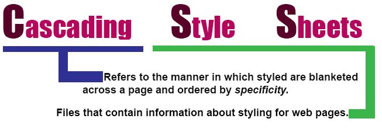

### 3 METHODS OF APPLYING CSS

***Inline***: Inline CSS styles are written into an HTML tag. 

` <p style="color: blue;">`

***Internal***: Internal css is written inside of an HTML document, inside the `<head>` tag, between two `<style>` tags. 
``` 
<style>
p {
    color: blue;
  }
</style> 
```

***External***: Seperate CSS files that are linked into the head of an HTML document are known as external css.

```
<head>
  <link rel="stylesheet" href="./style.css> 
</head>
``` 

### SELECTORS

This is either the tag we are trying to effect, or a special "name" that we give an html element in the form of an *ID* or a *class*. 

***Element Selectors***: These select the HTML elements with a matching HTML tag. This is the LEAST SPECIFIC CSS rule. 
``` 
p {
    background-color: black;
}

div {
    background-color: yellow
}
```

***Class Selectors***: These select those HTML elements with a matching class attribute. *They are prepended by a period*

index.html
```

```

style.css
```
.small-image {
    width: 100px;
}
```

***ID Selectors***: Refers to the element with a matching ID attribute. Unlike classes, which can be shared, IDs are *unique*. *They are prepended by a hashtag.*

index.html
``` 
<span id="bold-and-red">
```

style.css
```
#bold-and-red {
    font-weight: bold;
    color: red;
}
```
