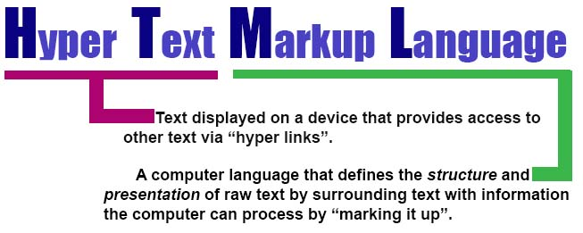
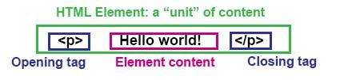

### HTML ELEMENTS

An HTML element is a wrapper for content on a web page that contains information about the type and structure of the content nested within it that the computer can interpret. 


##### DOCUMENT TYPE DECLARATION 

A type of HTML element, usually the first in an HTML document, that instructs the browser about what type of language is being used in the document. 

``` 
<!DOCTYPE html>
``` 

##### TAGS

Elements wrapped in angle brackets that signify the structure of type of content. They often create hierarchical structures, that we speak about as ancestors. One tag or element can be the parent of another, which then becomes its child. That child can have its own child, which becomes the grandchild of its parent. 

Most come in pairs, with an "opening" or a "closing" tag. Some are self closing, like image tags.

``` 


<div> </div>

``` 




*** There are two special tags that define the page's content, the `<head>` tag and the `<body>` tag. The head tag stores meta data, or information that most people don't see (like links that the page might use for css.) The body contains the content that a user will see.

##### ATTRIBUTES 

Attributes in HTML are name-value pairs that provide information about an element's content, for example, "src", "alt" or "data-value". 

``` 

```


